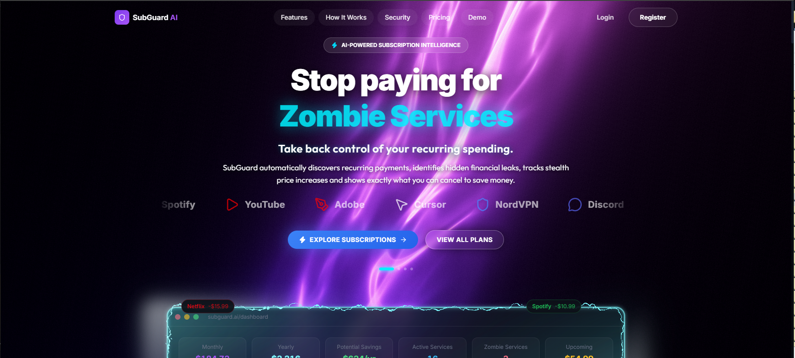
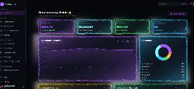
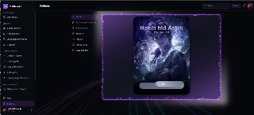

# 🛡️ SubGuard AI > Subscription Leakage & Zombie Service Exterminator

AI-powered subscription intelligence platform that detects recurring payments, zombie subscriptions, stealth price hikes, duplicate services and potential savings.

<div align="center">
  <br />
  <a href="https://shrug-hub-92562494.figma.site/" target="_blank">
    
  </a>
  &nbsp;&nbsp;&nbsp;
  <a href="https://drive.google.com/file/d/11bAoD6uqRglNIpwFG-0FMfbLVTz0L20-/view?usp=sharing" target="_blank">
    
  </a>
</div>
<br />

## 📸 Preview
### Landing Page


### Dashboard


### Settings & Profile


## ✨ Features
- 🔍 **Recurring subscription detection**: Identifies all active recurring charges.
- 🧟 **Zombie Subscription Score**: AI-powered score to identify unused subscriptions.
- 📈 **Price hike detection**: Alerts on stealth price increases.
- 💳 **Transaction analysis**: Deep dive into subscription spending.
- 👯 **Duplicate subscription detection**: Finds overlapping services (e.g., Netflix & Hulu).
- 💰 **Savings opportunity calculation**: Estimates potential yearly savings.
- 📅 **Upcoming payment forecasting**: Predicts upcoming charges.
- ❌ **Cancellation workflow**: Streamlined process for canceling services.
- 📊 **Financial dashboard**: Comprehensive overview of subscription health.
- 📱 **Responsive interface**: Optimized for all devices.

## 🧟 Zombie Score
SubGuard AI calculates a risk score based on:
- Low or no usage
- Duplicate services
- Price increases
- User feedback
- Long-term auto renewal

| Score | Status |
|------|------|
| 0–25 | Healthy |
| 26–50 | Watch |
| 51–75 | At Risk |
| 76–100 | Zombie |

## 🛠️ Tech Stack
- React
- TypeScript
- Vite
- Tailwind CSS
- Framer Motion
- Recharts
- Three.js
- Lucide React

## 📂 Project Structure
```text
src/
├── components/
├── pages/
├── assets/
├── hooks/
└── utils/
```

## 🚀 Getting Started

Clone the repository:
```bash
git clone https://github.com/ASHIK311/subguard-ai.git
```

Install dependencies:
```bash
npm install
```

Run locally:
```bash
npm run dev
```

## 🔐 Environment Variables
Create a `.env` file for any required configuration (if applicable):
```
VITE_YOUR_VARIABLE=your_value
```
*Note: Never commit your real `.env` file.*

## 📊 Prototype Results
- **14** subscriptions detected
- **3** potential zombie subscriptions
- **2** price-increase events
- **$624.20** estimated annual savings
- **1** duplicate streaming-service pair detected

## 🔮 Future Improvements
- Open banking integration
- Personalized ML risk ranking
- Real cancellation integrations
- Family subscription support
- Renewal notifications

## 👨‍💻 Author
**Nakib Md Ashik**
Computer Science & Engineering
Daffodil International University

## 📄 License
[MIT License](LICENSE)
